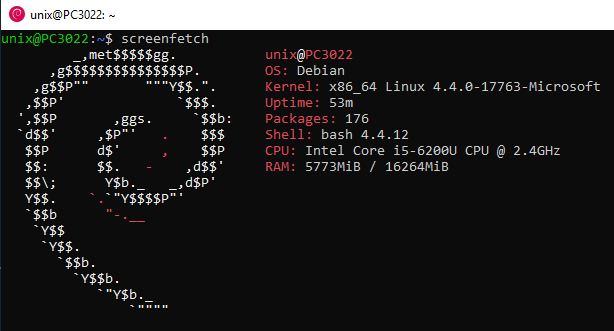
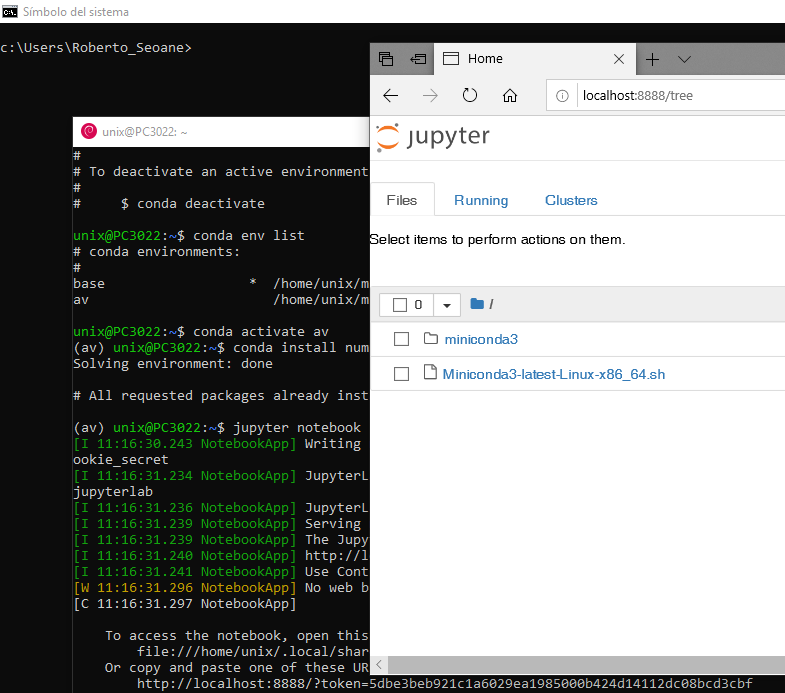

# Windows Subsystem for Linux

Windows 10 y Windows Server 2016 incluyen una nueva funcionalidad llamada WSL que permite la ejecución de distribuciones de Linux mediante emulación.

La puesta en marcha es muy sencilla, solo tenemos que instalar una característica de Windows y descargar las distribuciones de Linux que queramos desde la tienda de Windows.

```powershell

Enable-WindowsOptionalFeature -FeatureName Microsoft-Windows-Subsystem-Linux -online
Get-WindowsOptionalFeature -FeatureName Microsoft-Windows-Subsystem-Linux -online

```

En la tienda de Windows actualmente se encuentran las siguientes distribuciones:

- Ubuntu 16.04
- Ubuntu 18.04
- Debian GNU/Linux
- WLinux (la mejor, pero de pago)
- Fedora Remix
- Alpine WSL
- Kali Linux
- OpenSUSE Leap 42
- SUSE Linux Enterprise Server 12

La primera vez que se usa una distribución de linux, se realizan una serie de tareas de configuración y se nos pide algo de información. Normalmente se pide únicamente un nombre de usuario y una contraseña para acceder a la distribución.

**Nota.** Si no tenemos acceso a al tienda, algunas distribuciones se pueden descargar desde la página https://docs.microsoft.com/en-us/windows/wsl/install-manual. 

Una vez descargado el archivo lo instalamos de la siguiente manera:

```powershell

# Distribución Debian
Add-AppxPackage -Path .\DebianGNULinux_1-1-3-0_x64__76v4gfsz19hv4.Appx
#Distribución Ubuntu 18.04
Add-AppxPackage -Path .\CanonicalGroupLimited.Ubuntu18.04onWindows_1804.2018.817.0_x64__79rhkp1fndgsc.Appx
#Distribución Ubuntu 16.04


```

Para ver qué distribuciones tenemos instaladas y establecer cuál es la predeterminada, usaremos el comando wslconfig.

```powershell

C:\temporal> wslconfig /list
Distribuciones del subsistema de Windows para Linux:
Ubuntu (predet.)
Debian
Ubuntu-18.04

wslconfig /setdefault Debian

```

**Nota.** En mi caso tengo instaladas tres distribucuiones que iré usando a lo largo del documento.

***

## Acceso a las distribuciones instaladas

Podemos acceder a las diferentes distribuciones de varias maneras:

- Mediante el icono del menú Inicio
- Mediante línea de comandos

Si usamos la línea de comandos podemos elegir la distribución a ejecutar mediante su nombre:

- Para lanzar Ubuntu 16.04 ejecutamos: **ubuntu**
- Para lanzar Ubuntu 18.04 ejecutamos: **ubuntu1804**
- Para lanzar Ubuntu Debian ejecutamos: **debian**

***

## Comando wsl.exe

El comando wsl ejecuta la distribución que esté configurada como predeterminada.

```bash

#Acceso interactivo
C:\temporal> wsl
To run a command as administrator (user "root"), use "sudo <command>".
See "man sudo_root" for details.

unix@PC3022:/mnt/c/temporal$ uname -a
Linux PC3022 4.4.0-17763-Microsoft #194-Microsoft Mon Dec 03 17:58:00 PST 2018 x86_64 x86_64 x86_64 GNU/Linux
unix@PC3022:/mnt/c/temporal$

```

También podemos ejecutar comandos sin tener que entrar en el modo interactivo, incluso podemos combinar comandos de Windows o PowerShell con comandos de linux:

```powershell

# Consultando a la distribución ubuntu 16.04
C:\temporal> ubuntu run uname -a
Linux PC3022 4.4.0-17763-Microsoft #194-Microsoft Mon Dec 03 17:58:00 PST 2018 x86_64 x86_64 x86_64 GNU/Linux

# Combinando powershell con el comando grep de la distribución ubuntu 18.04
C:\temporal> Get-Process | ubuntu1804 run grep power*
    954      49   176652     213488      12,16   9388   1 powershell

# Llamando a la distribución por defecto (Debian en mi caso)
C:\temporal> wsl ip a
47: eth0: <BROADCAST,MULTICAST,UP> mtu 1500 group default qlen 1
    link/ether 02:15:74:bf:cd:e6
    inet 172.17.154.161/28 brd 172.17.154.175 scope global dynamic
    ....................

C:\temporal> wsl cat /etc/resolv.conf
# This file was automatically generated by WSL. To stop automatic generation of this file, remove this line.
nameserver 194.30.0.1

C:\temporal> ipconfig | wsl grep IPv4
   Dirección IPv4. . . . . . . . . . . . . . : 10.0.75.1
   Dirección IPv4. . . . . . . . . . . . . . : 192.168.1.22
   Dirección IPv4. . . . . . . . . . . . . . : 192.168.56.1

```

***

## Ejemplo de funcionamiento interactivo

Lo primero que hacemos al acceder a una distribución de Linux, es actualizarla:

```bash

sudo apt update
sudo apt upgrade
sudo apt install screenfetch

```



Vamos a ver un ejemplo de cómo instalar un programa en Debian. Por ejemplo, instalaré Miniconda.

```bash

sudo apt install curl
sudo apt install bzip2
curl -O https://repo.continuum.io/miniconda/Miniconda3-latest-Linux-x86_64.sh
chmod 744 Miniconda3-latest-Linux-x86_64.sh
./Miniconda3-latest-Linux-x86_64.sh

# Creación de un entorno virtual
conda create -n av python=3 anaconda
conda env list
conda activate av
conda install numpy
jupyter notebook
#Finalmente nos conectamos con un navegador a la url que nos indique la consola

```



Oh yeah!!!!!
